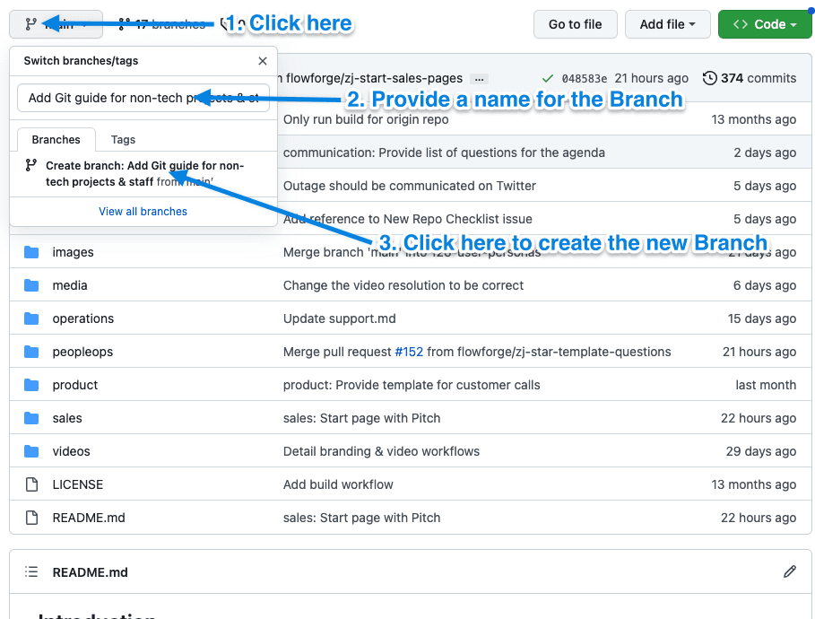
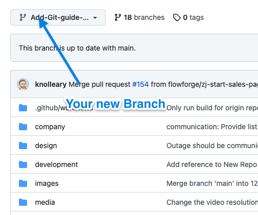

# How to use Git (for non-developer team members)

## Background

Git is a way for a team to create written content, track any changes to that content, and seek approval for any changes to become the published version of that content. Git can be used in many ways, our developers use it to write the code which makes FlowForge work but in this document we are focussing on the process to work with documents which are part of our Handbook and Website, we will use Git’s name for these entities ‘Projects’ for the rest of this guide. In this guide we will assume you will be using github.com to interact with Git.

## How to edit a Project

### Create a Branch

The first step to editing content is to create a Branch of that content. A Branch is a complete copy of the Project. Creating a Branch allows you to edit the content without those edits being seen in the published copy of the Project.

Navigate to the Project within Github you want to work on, usually…

[https://github.com/flowforge/website](https://github.com/flowforge/website)

or

[https://github.com/flowforge/handbook](https://github.com/flowforge/handbook)

The Branch name should give a brief overview of what you are planning to change in the Project, for example ‘Add Git guide for non-tech projects & staff’ the click the ‘create branch’ text.

You should now notice that where the drop down said ‘main’ before it now says the name of the Branch you just created.

You can now start the process of actually creating or editing content, any changes you make will not yet be added to the Published version of the live Project.

### Create a new document

In this exemple I am going to create a new document in the Handbook which will help non-technical FlowForge team members use Git.

Firstly I will create a new document called git-how-to.md in the design folder.

The file type is .md (Markdown). A Markdown file is similar to a .docx or .txt. It allows you to lay out content in a document including text, images, titles, headers and tables. You can read more about how to lay out a document in Markdown here.

In the video above I pressed ‘Commit changes’ which is the same as saving your document.

### Editing your document

I can now start the process of writing my document, first I will reopen it in the editor, then I will add the content.

I will work on the file until I think it's ready for a colleague to review the changes I have made. Once I am happy with the content I will Commit the changes as I did before.

### Creating a Pull Request

I am now ready to request a Review of my work from a colleage. To do this I need to create a Pull Request. Once you create the Pull Request an alert will be sent to your Colleagues asking them for feedback on your work.

Github gives you an easy to find button to create a Pull Request for your current work. 

It's a good idea to give your colleagues descriptive comments about what changes you have made or anything else you think would be useful to help them review your work.

Once you press the 'Create pull request' button an alert will be sent to one of FlowForge's Slack channels letting everyone know you'd like your work reviewed. You can also request a review from a specific colleague using the Reviewers section of your Pull Request. Click on Reviewers then select the collegaue you think would be best placed to review your work.

